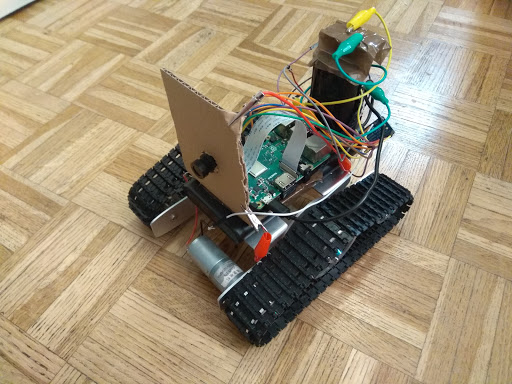
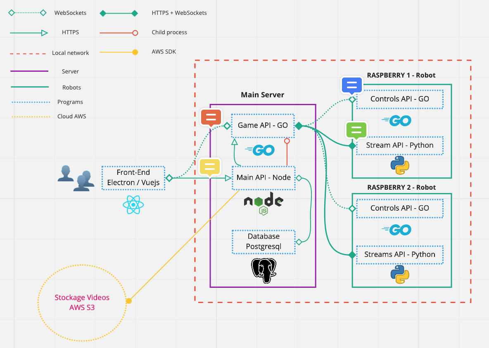

# BattleBots

### Join in real robots fight from your browser !

## Features

- Pilot a robot from you browser
- Fight in an arena with other player
- Watch other player game with a streaming service
- Choose from multiples robots with specials abilty

## Architecture

## app/

#### api-bot
sources of the apis running on the raspi, handle controls and events, interactions with the gpio

#### api-go
sources of the api running the game instances and handling video streams and socket connexions,
middleman between the client and the bots 

#### api-node
sources of the website api wtritten in node and using typeorm, also host the front end

#### vuejs
sources of the application front end

## infra/

Deployment scripts

## docs/

Documentation and ressources
